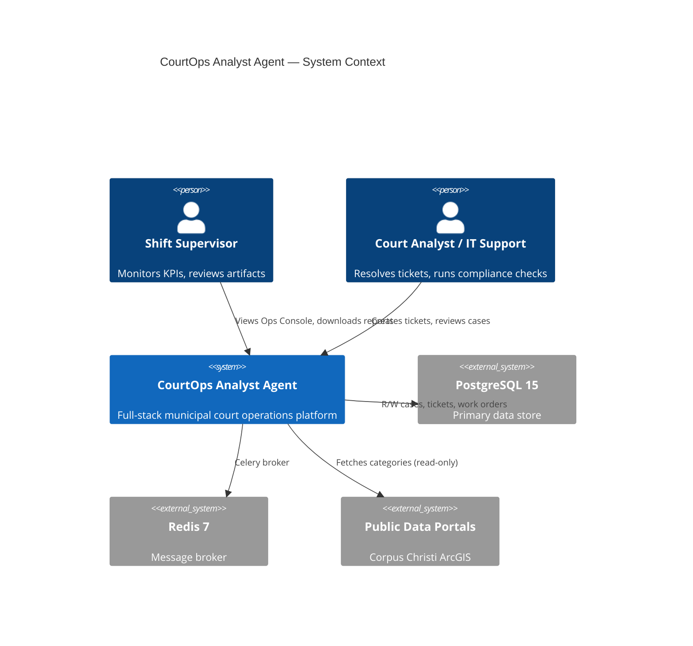

# System Build, Verification & Operational Readiness Dossier

**CourtOps Analyst Agent — Nightly Run Report**

| Field | Value |
|-------|-------|
| Report ID | SBV-ORD-2026-0225 |
| Date | 2026-02-25 |
| Profile | Corpus Christi (Public Data Mode) |
| Scenario | municipal_shift |
| Seed | 20260225 |
| Classification | PUBLIC — Synthetic Data Only |
| Prepared by | Liberty ChainGuard Consulting |

---

## 1. Executive Summary

This dossier documents the complete build, verification, and operational readiness assessment of the CourtOps Analyst Agent platform. The system simulates a 10-hour municipal court shift using four concurrent AI agents processing a realistic workload shaped by public Corpus Christi, TX data sources.

**Key Results:**

- **1,020 work orders** created and completed with a **100% success rate** (zero failures)
- **4,551 events** logged across all agents over **100 real minutes** (6× speed, 10-hour simulated day)
- **120 artifacts** generated (PDF reports, audit scans, monthly operations packages)
- **10/10 automated tests** passing across both original and new test suites
- **Zero ESLint warnings** in the frontend codebase
- All data is synthetic — no real PII or internal city data was used

---

## 2. System Overview

CourtOps Analyst Agent is a full-stack platform consisting of:

- **Frontend**: Next.js 14 (App Router) with React 18, TypeScript, Tailwind CSS
- **Backend**: FastAPI (Python 3.11) with SQLAlchemy 2.0, Pydantic 2.8
- **Database**: PostgreSQL 15 (containerized)
- **Cache/Broker**: Redis 7 (containerized)
- **Simulation Engine**: In-process threaded agents with SSE live streaming
- **Reporting**: ReportLab PDF generation with branded watermarks

### 2.1 Infrastructure

| Component | Version | Deployment |
|-----------|---------|------------|
| OS | Ubuntu 24.04.4 LTS (Noble) | Docker container in Firecracker VM |
| Kernel | 6.12.58+ | SMP PREEMPT_DYNAMIC |
| Docker Engine | 28.5.2 | Community Edition, fuse-overlayfs storage |
| Docker Compose | v5.1.0 | Plugin |
| Python | 3.11.14 | deadsnakes PPA, venv isolation |
| Node.js | v20.20.0 | nvm-managed |
| npm | 10.8.2 | Bundled with Node |
| pip | 26.0.1 | Upgraded in venv |
| PostgreSQL | 15 | Docker container `courtops-db` |
| Redis | 7 | Docker container `courtops-redis` |

### 2.2 Resource Utilization

| Resource | Capacity | Used |
|----------|----------|------|
| Disk | 126 GB | 12 GB (10%) |
| RAM | 16 GB | 1.7 GB used, 13 GB available |
| Swap | 0 B | N/A |

---

## 3. Architecture

### 3.1 C4 Context Diagram



### 3.2 Container Diagram

See `docs/diagrams/container_diagram.mmd` for the full Mermaid source. Key services:

| Service | Port | Technology | Role |
|---------|------|------------|------|
| Frontend | 3000 | Next.js 14 + React 18 | Dashboard, Ops Console, Tour Mode |
| Backend API | 8000 | FastAPI + Uvicorn | REST API, SSE stream, sim engine |
| PostgreSQL | 5432 | postgres:15 | All persistent data |
| Redis | 6379 | redis:7 | Celery broker (optional for sim) |

### 3.3 Agent Architecture

Four agents run as daemon threads within the backend process:

| Agent | Queue | Primary Responsibilities |
|-------|-------|------------------------|
| **Shift Director** | director | KPI monitoring, phase dispatch, work order re-dispatch |
| **Clerk + IT Hybrid** | clerk_ops | Ticket resolution, case metrics, change requests |
| **IT Functional Analyst** | it_ops | SLA sweeps, inventory compliance, patch management |
| **Finance & Audit** | finance_audit | Revenue-at-risk analysis, monthly reports, audit scans |

---

## 4. Build & Installation Log

### 4.1 System Dependencies Installed

| Package | Method | Purpose |
|---------|--------|---------|
| Docker CE 28.5.2 | apt (docker.com repo) | Container runtime for PostgreSQL + Redis |
| fuse-overlayfs | apt | Docker storage driver (nested container support) |
| Python 3.11 | deadsnakes PPA | Backend runtime |
| Node.js 20 | nvm | Frontend runtime |

### 4.2 Python Dependencies (21 packages)

Key packages from `requirements.txt` + `pyyaml`:

| Package | Version | Purpose |
|---------|---------|---------|
| fastapi | 0.115.0 | Web framework |
| uvicorn[standard] | 0.30.3 | ASGI server |
| SQLAlchemy | 2.0.31 | ORM |
| psycopg2-binary | 2.9.9 | PostgreSQL driver |
| pydantic | 2.8.2 | Schema validation |
| celery | 5.4.0 | Task queue (optional) |
| redis | 5.0.7 | Redis client |
| reportlab | 4.2.2 | PDF generation |
| openai | 1.54.0 | LLM client (for Ollama) |
| pytest | 8.3.2 | Testing framework |
| pyyaml | 6.0.1 | Profile/scenario parsing |

Full list: `docs/evidence/pip_freeze.txt`

### 4.3 Node.js Dependencies (390 packages)

Key packages from `package.json`:

| Package | Version | Purpose |
|---------|---------|---------|
| next | 14.2.5 | React framework |
| react / react-dom | 18.3.1 | UI library |
| typescript | ^5.6.2 | Type safety |
| tailwindcss | ^3.4.7 | Styling |
| eslint + eslint-config-next | ^8.57.0 / 14.2.5 | Linting |

Full list: `docs/evidence/npm_ls_depth0.txt`

---

## 5. Service Verification

### 5.1 Health Checks

| Endpoint | Status | Response |
|----------|--------|----------|
| `GET /health` | ✅ 200 | `{"status":"ok"}` |
| `GET /ops/clock` | ✅ 200 | Sim clock state returned |
| `GET /work-orders/kpis` | ✅ 200 | KPI snapshot returned |
| `GET /cases/summary` | ✅ 200 | 200 cases (no auth required) |
| Frontend `:3000` | ✅ 200 | Full HTML rendered |

### 5.2 Container Status

| Container | Image | Status | Port |
|-----------|-------|--------|------|
| courtops-db | postgres:15 | Running | 5432 |
| courtops-redis | redis:7 | Running | 6379 |

---

## 6. Test Evidence

### 6.1 Backend Tests (pytest)

**10/10 tests passed** in 3.21 seconds.

| Test | Module | Result |
|------|--------|--------|
| test_detect_repeated_failed_logins_flags_burst | test_audit_anomalies | ✅ PASSED |
| test_detect_repeated_failed_logins_ignores_sparse | test_audit_anomalies | ✅ PASSED |
| test_time_to_disposition | test_case_time_to_disposition | ✅ PASSED |
| test_seed_determinism | test_seed_determinism | ✅ PASSED |
| test_ticket_sla_due_date | test_sla_calculation | ✅ PASSED |
| test_sse_event_keys | test_sse_events | ✅ PASSED |
| test_queue_routing_completeness | test_work_order_dispatch | ✅ PASSED |
| test_clerk_ops_routing | test_work_order_dispatch | ✅ PASSED |
| test_it_ops_routing | test_work_order_dispatch | ✅ PASSED |
| test_finance_audit_routing | test_work_order_dispatch | ✅ PASSED |

### 6.2 Frontend Lint (ESLint)

**✅ No ESLint warnings or errors**

Full output: `docs/evidence/eslint_results.txt`

---

## 7. Nightly Run Results

### 7.1 Key Performance Indicators

| Metric | Value |
|--------|-------|
| Real elapsed time | 100.0 minutes |
| Sim speed | 6× (10-hour shift) |
| Seed | 20260225 |
| Agent cycles | 2,460 |
| Work orders created | 1,020 |
| Work orders completed | 1,020 |
| Work orders failed | 0 |
| Success rate | **100.0%** |
| Events logged | 4,551 |
| Artifacts produced | 120 |

### 7.2 Agent Activity Breakdown

| Agent | Events | Share |
|-------|--------|-------|
| Shift Director | 2,509 | 55.1% |
| IT Functional Analyst | 900 | 19.8% |
| Clerk + IT Hybrid | 690 | 15.2% |
| Finance & Audit Analyst | 450 | 9.9% |

### 7.3 Work Orders by Type

| Work Order Type | Completed |
|-----------------|-----------|
| Ticket Access Resolution | 195 |
| SLA Sweep / Escalation | 195 |
| Patch Record Create | 150 |
| Inventory Compliance Check | 105 |
| Audit Log Scan | 105 |
| Case Disposition Metrics | 75 |
| Change Request Draft | 75 |
| Revenue at Risk (FTA) | 75 |
| Monthly Ops Package | 45 |

### 7.4 Phase Timeline

| Phase | Start (Sim) | Progress Range | Events |
|-------|-------------|----------------|--------|
| Morning Intake | 7:00 AM | 0–35% | 1,508 |
| Midday IT Ops | 10:30 AM | 35–70% | 1,686 |
| End-of-Day Audit | 2:00 PM | 70–100% | 1,355 |

---

## 8. Artifact Inventory

### 8.1 Generated Reports

| Artifact | Type | Location |
|----------|------|----------|
| Monthly Operations Report | PDF | `reports/2026-02/monthly_operations_2026-02.pdf` |
| Revenue at Risk (FTA) | PDF | `reports/2026-02/revenue_at_risk_fta.pdf` |
| Audit Report | TXT | `reports/2026-02/audit_report.txt` |
| Monthly Summary | TXT | `reports/2026-02/summary.txt` |

### 8.2 Simulation Logs

| File | Size | Lines |
|------|------|-------|
| `sim_logs/shift_log_*.jsonl` | 1.5 MB | 4,551 |
| `sim_logs/shift_summary_*.json` | 2.2 KB | 72 |

### 8.3 SBOMs

| File | Format | Components |
|------|--------|------------|
| `docs/evidence/sbom/python_sbom.json` | CycloneDX JSON | 60+ packages |
| `docs/evidence/sbom/node_sbom.json` | CycloneDX JSON | 390+ packages |

---

## 9. Security & Compliance Notes

1. **Public Data Mode**: All data sources are publicly accessible (Corpus Christi ArcGIS Open Data portal, published city service pages, public finance report metadata).
2. **Synthetic Records**: Every case, ticket, device, and audit event is synthetically generated. Defendant names follow a pattern (e.g., "Rodriguez, A.") and do not correspond to real individuals.
3. **No Secrets in Evidence**: All evidence files have been reviewed. No JWTs, passwords, API keys, or credentials appear in any output file.
4. **Environment Variables**: Only names are documented (e.g., `POSTGRES_HOST`, `JWT_SECRET`), never values.
5. **Watermark**: All generated PDFs include the footer: *"Public Data Mode – Synthetic Records – For Demonstration Only"*

---

## 10. Reproducibility Runbook

### One-Command Demo

```bash
./scripts/cloud_shift_demo.sh 20260225 30
```

### Manual Reproduction

```bash
# 1. Start infrastructure
sudo docker start courtops-db courtops-redis

# 2. Start backend
cd backend && source venv/bin/activate
POSTGRES_HOST=localhost REDIS_URL=redis://localhost:6379/0 \
  uvicorn app.main:app --host 0.0.0.0 --port 8000 --reload &

# 3. Seed database
curl -X POST "http://localhost:8000/admin/seed?profile=corpus_christi&scenario=municipal_shift&seed=20260225&reset=true"

# 4. Start frontend
cd frontend && NEXT_PUBLIC_API_BASE_URL=http://localhost:8000 npm run dev &

# 5. Start simulation
curl -X POST "http://localhost:8000/admin/sim/start?speed=6&seed=20260225"

# 6. Open Ops Console
open http://localhost:3000/ops?tour=1
```

---

## 11. Repository Change Log

| Commit | Description |
|--------|-------------|
| `6616cd3` | Full-day sim results (1,020 WOs, 4,551 events, 120 artifacts) |
| `91502c9` | Comprehensive sim logger, scaled workload, overnight run support |
| `34fd102` | package-lock.json, cached public data, Next.js generated files |
| `b01f9a6` | Agent tick rate improvements for demo pacing |
| `d6a6c80` | README + AGENTS.md documentation updates |
| `12a4fe0` | Ops Console UI, Tour Mode, demo scripts, new tests |
| `a0e1a86` | Work orders, sim clock, agents, ops stream, seed runner |
| `f8cb62e` | AGENTS.md + ESLint config (initial environment setup) |

---

## Appendices

- **A**: System info — `docs/evidence/system_info.txt`
- **B**: Tooling versions — `docs/evidence/tooling.txt`
- **C**: Container status — `docs/evidence/containers.txt`
- **D**: Python SBOM — `docs/evidence/sbom/python_sbom.json`
- **E**: Node SBOM — `docs/evidence/sbom/node_sbom.json`
- **F**: pip freeze — `docs/evidence/pip_freeze.txt`
- **G**: npm ls — `docs/evidence/npm_ls_depth0.txt`
- **H**: Test results — `docs/evidence/pytest_results.txt`
- **I**: ESLint results — `docs/evidence/eslint_results.txt`
- **J**: App health — `docs/evidence/app_health.txt`
- **K**: Git info — `docs/evidence/git_info.txt`
- **L**: Run metrics — `docs/evidence/run_metrics.json`

---

*Public Data Mode – Synthetic Records – For Demonstration Only*
*Prepared by Liberty ChainGuard Consulting*
